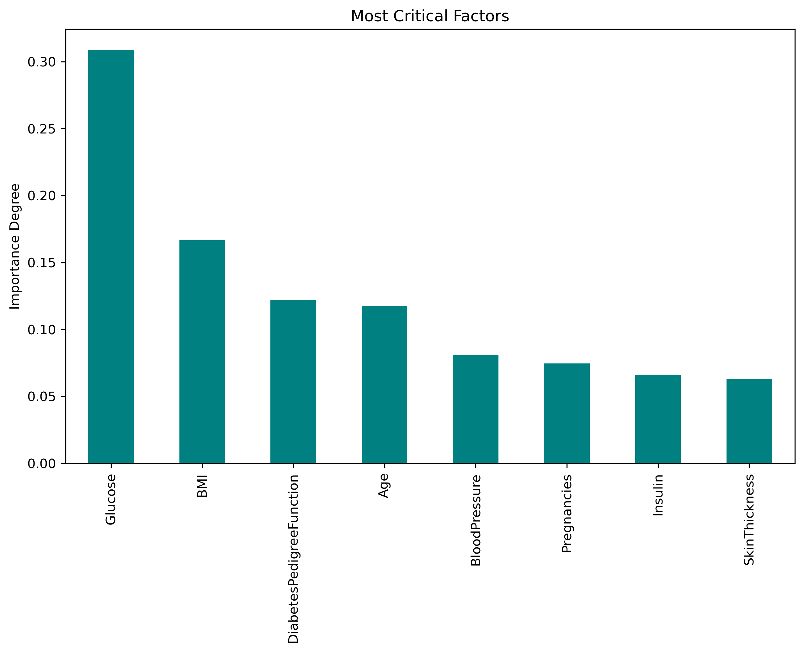

# diabetes-prediction-model

# 🩺 Diabetes Prediction System

This project is a Machine Learning application that predicts whether a patient has diabetes based on diagnostic measurements. The model utilizes **Logistic Regression** and demonstrates the importance of **Feature Scaling (Standardization)** in classification problems.

## 🚀 Project Overview
The goal is to classify patients into two groups:
* **0 (Negative):** Healthy / No Diabetes
* **1 (Positive):** Diabetic

Using the Pima Indians Diabetes Dataset, I built a predictive model that achieves **~74.68% accuracy**.

## 📊 Dataset Features
The dataset consists of medical predictors and one target variable:
* **Pregnancies:** Number of times pregnant
* **Glucose:** Plasma glucose concentration
* **BloodPressure:** Diastolic blood pressure (mm Hg)
* **SkinThickness:** Triceps skin fold thickness (mm)
* **Insulin:** 2-Hour serum insulin (mu U/ml)
* **BMI:** Body mass index
* **DiabetesPedigreeFunction:** Diabetes pedigree function
* **Age:** Age (years)
* **Outcome:** Class variable (0 or 1)

## 🛠️ Methodology & Process

### 1. Exploratory Data Analysis (EDA)
* Analyzed the relationship between `Glucose` levels and the `Outcome`.
* Checked for class imbalance and data distribution.

### 2. Model Evolution
I followed an iterative approach to improve the model's performance:

* **Iteration 1 (Base Model):** Trained Logistic Regression on raw data.
    * *Result:* Accuracy ~74.03%
    * *Observation:* The model struggled with convergence due to varying scales of features (e.g., Insulin vs. Age).
    
* **Iteration 2 (Optimized Model):** Applied **StandardScaler** to normalize features (Mean=0, Std=1).
    * *Result:* Accuracy increased to **74.68%**
    * *Benefit:* The optimization process became stable, and `ConvergenceWarning` was resolved.

## 📈 Model Performance
* **Algorithm:** Logistic Regression (max_iter=1000)
* **Final Accuracy:** 74.68%
* **Confusion Matrix Analysis:**
    * **True Negatives (TN):** 90 (Healthy patients correctly identified)
    * **False Negatives (FN):** 29 (Missed cases - Type 2 Error)
    * **False Positives (FP):** 10 (False Alarms - Type 1 Error)
    * **True Positives (TP):** 25 (Diabetic patients correctly identified)

## 💻 Technologies Used
* **Python**
* **Pandas & NumPy** (Data Manipulation)
* **Matplotlib** (Visualization)
* **Scikit-Learn** (Model, Scaling, Metrics)

## ⚔️ Model Comparison & Optimization

To achieve the best possible result, I compared two different classification algorithms.

1.  **Baseline Model (Logistic Regression):** First, I established a baseline using a linear approach.
2.  **Challenger Model (K-Nearest Neighbors):** Then, I implemented KNN to capture non-linear patterns in the data. I used a loop to find the optimal 'k' value.

### 🏆 Results Table
| Model | Parameters | Accuracy Score | Status |
| :--- | :--- | :---: | :---: |
| **Logistic Regression** | `max_iter=1000` | 74.68% | Baseline |
| **K-Nearest Neighbors (KNN)** | `n_neighbors=15` | **75.97%** | **Winner 🚀** |

### 💡 Key Findings
* The **Logistic Regression** model provided a solid baseline but struggled with potential non-linear relationships in the health data.
* **KNN** performed better when $k=15$. Lower values of $k$ (e.g., $k=3$) caused overfitting, while higher values (e.g., $k=50$) caused underfitting.
* **Conclusion:** The KNN algorithm (with $k=15$) is the superior model for this specific dataset and preprocessing pipeline.

## 🌲 Model V3.0: Random Forest Optimization

In this update, I moved from a single **Decision Tree** to a **Random Forest Classifier** to improve model stability and generalization.

Instead of guessing parameters, I used **`GridSearchCV`** to find the optimal settings.

### 📊 Performance Report
| Model | Method | Accuracy | Status |
| :--- | :--- | :---: | :---: |
| **Decision Tree** | Single Tree (Prone to overfitting) | ~79% (High Variance) | Deprecated |
| **Random Forest** | Ensemble of 100+ Trees | **77.52%** | **Stable & Robust ✅** |

### 🔍 Key Improvements
* **Reduced Variance:** By averaging multiple trees, the model is less sensitive to noise in the dataset.
* **Hyperparameter Tuning:** Optimized `n_estimators`, `max_depth`, and `min_samples_split` using 5-fold Cross-Validation.
* **Feature Insights:** Confirmed that *Glucose* and *BMI* are the strongest predictors for diabetes.



# 🩺 Diabetes Prediction Project (End-to-End Classification)

This project aims to predict whether a patient has diabetes based on diagnostic measurements. The workflow simulates a real-world data science process, focusing on data cleaning, feature engineering, and model optimization.

## 🚀 Key Highlights (Final Result)
After evaluating different algorithms and data cleaning techniques, the most robust model was achieved using **Random Forest** combined with **Mean Imputation** and custom **Feature Engineering**.

* **🏆 Final Accuracy:** **77.86%**
* **Best Model:** Random Forest Classifier (Optimized via GridSearchCV)

---

## 🛠️ Methodology & Evolution

### 1. Data Cleaning (Handling Invalid Zeros)
The dataset contained '0' values in columns where 0 is biologically impossible (e.g., Insulin, BMI, Glucose).
* **Attempt 1 (KNN Imputer):** Tried filling missing values using Nearest Neighbors to capture complex patterns. Resulted in **77.04%** accuracy.
* **Solution (Mean Imputation):** Replacing 0s with the column mean proved to be more stable for this specific dataset, improving accuracy to **77.86%**.

### 2. Feature Engineering 🧠
* **New Feature:** Created a `G/I Ratio` (Glucose / Insulin).
* **Logic:** This ratio helps the model capture **Insulin Resistance**, providing a biological context beyond raw numbers.

### 3. Model Comparison
I tested baseline models against ensemble methods to find the best fit.

| Model | Technique | Accuracy | Status |
| :--- | :--- | :---: | :---: |
| **Logistic Regression** | Baseline | 74.68% | Baseline |
| **KNN** | Standard Scaler | 75.97% | Moderate |
| **Decision Tree** | Single Tree | ~78% | High Variance |
| **Random Forest** | KNN Imputer | 77.04% | Good, but complex |
| **Random Forest** | **Mean Imputer + Feature Eng.** | **77.86%** | **🏆 CHAMPION** |

### 4. Hyperparameter Tuning
Used `GridSearchCV` (5-Fold Cross-Validation) to tune the Random Forest:
* `n_estimators`: Tested 100, 200 trees.
* `max_depth`: Optimized to prevent overfitting.
* `min_samples_split`: Adjusted to handle noise.

---

## 📊 Conclusion
This project demonstrated that **data quality and feature engineering** are often more important than model complexity.
By correctly handling missing values and adding the `Glucose/Insulin` ratio, I achieved a **~3.2% improvement** over the baseline Logistic Regression model.

## 💻 Tech Stack
* **Python** (Pandas, NumPy)
* **Scikit-learn** (Modeling, GridSearch, Preprocessing, Imputation)
* **Matplotlib** (Visualization)

## 📥 Installation & Usage

1.  **Clone the repo:**
    ```bash
    git clone [https://github.com/YOUR_USERNAME/diabetes-prediction.git](https://github.com/YOUR_USERNAME/diabetes-prediction.git)
    ```
2.  **Install requirements:**
    ```bash
    pip install pandas numpy matplotlib scikit-learn
    ```
3.  **Run the Notebook:**
    Open `diabetes_prediction.ipynb` to see the step-by-step analysis.

---
## 👨‍💻 Author
**Developed by [Ergün Üngör](https://github.com/ergunungor)**
